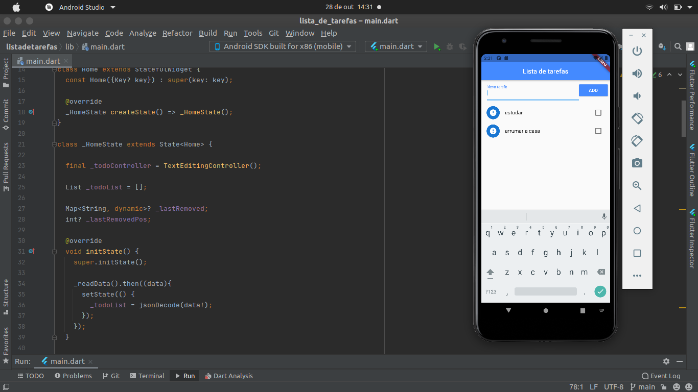

# Lista de Tarefas

Desenvolvida com Flutter, essa aplicação serve para anotar as tarefas para serem feitas ao longo do dia. Além disso, esse software adiciona, remove, marca como feito uma tarefa e exclui uma tarefa.

## Preview

<h1 align="center">
    
</h1>

## Tecnologias

- Flutter
